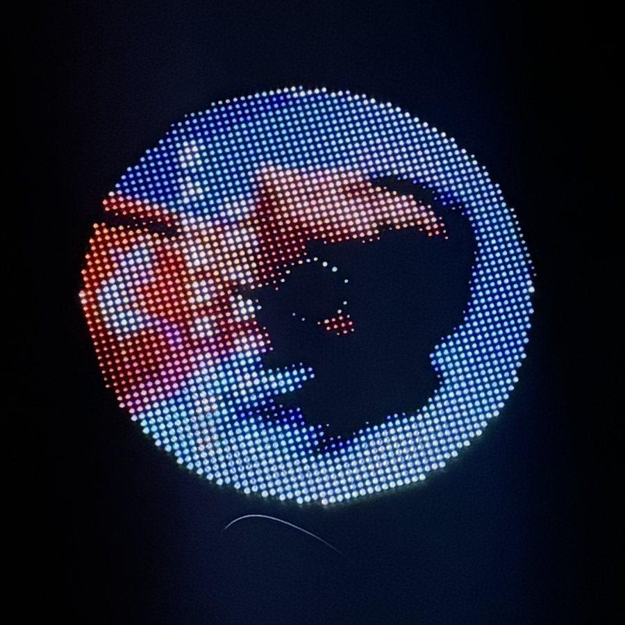
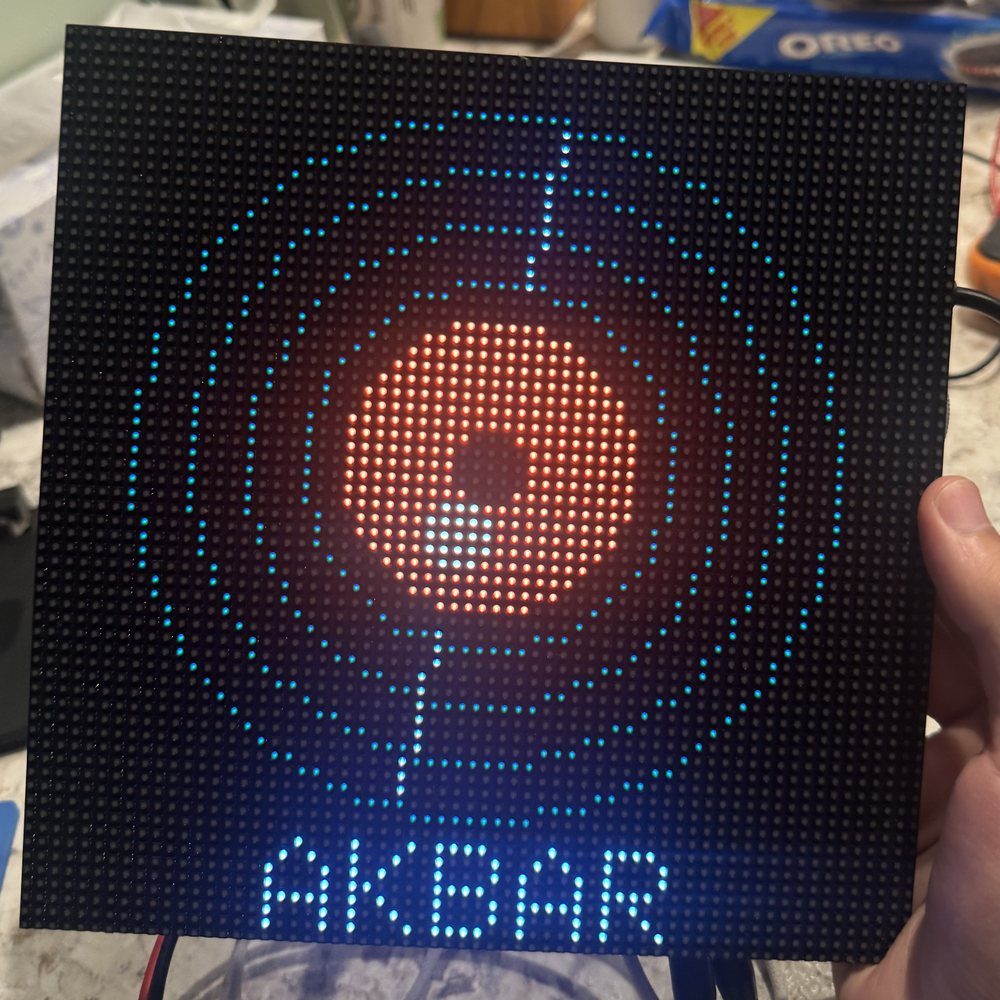
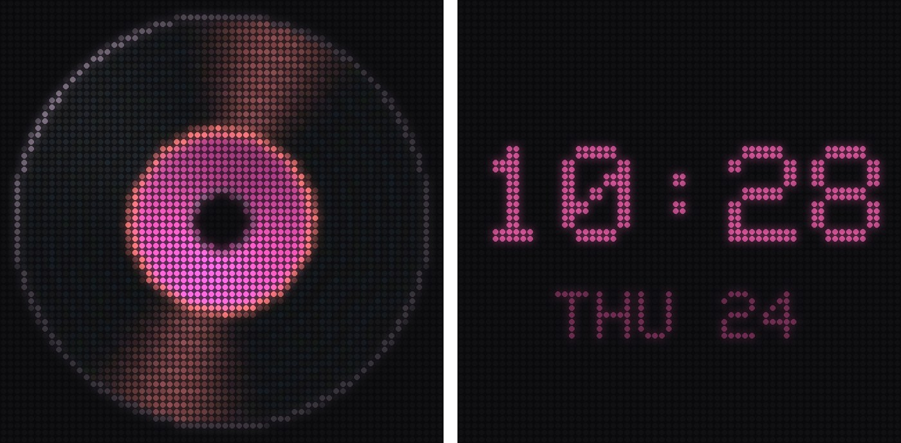
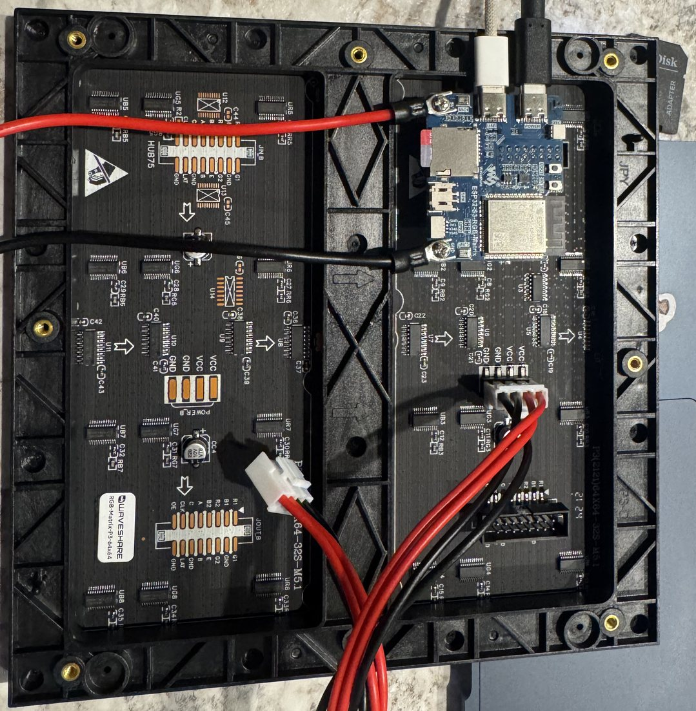

# Now Spinning

A 64×64 LED display that spins the album cover of whatever you're playing, like a picture-disc vinyl.
It follows YouTube Music on a Mac and on an iPhone. Once it's set up, the iPhone side works without the Mac.

<p align="center">
  
  
</p>

## Features
- **Mac:** a small Chrome extension reads the YouTube Music player and sends the real thumbnail over Wi-Fi.
- **iPhone:** pairs over Bluetooth Low Energy (Apple Media Service), gets the title and artist, and looks the cover
  up online (Apple Music catalog, then Deezer). With no match, it draws a vinyl colored from the song's name.
- **Tap the frame:** double tap = next track, triple tap = play/pause. The tap goes to whichever device is playing.
- **Idle clock and night mode:** a quiet clock appears after 5 minutes without music. From 11 pm to 7 am the display
  dims, and it goes fully dark when idle at night.
- **Wi-Fi firmware updates** after the first USB flash (`./matrix flash`).
- **Smooth:** 30 fps rendering with a 300 Hz panel scan and no flicker, while HTTPS and Bluetooth run alongside.

<p align="center">
  
  <br><sub>Generated art for a song with no catalog cover (left), and the idle clock (right).
  Both are rendered from the firmware's own drawing code.</sub>
</p>

## Bill of materials
Prices as of September 2026, before tax.

| Qty | Part | Notes | Waveshare direct | Amazon (US) |
|---|---|---|---|---|
| 1 | **Waveshare ESP32-S3-RGB-Matrix** driver board (SKU 34422) | ESP32-S3, 32 MB flash, 16 MB PSRAM, IMU, 2 mics, audio codec, **8 Ω speaker included** | $24.99 | ~$35 |
| 1 | **Waveshare RGB-Matrix-P3-64x64** panel (SKU 22100) | 192 × 192 mm, HUB75. Includes power lead and ribbon | $29.99 | ~$38.50 |
| 1 | 5 V USB-C power supply, 3 A or more | e.g. Waveshare 27 W PD (SKU 27775) or any 27 W USB-C supply | $6.99 | ~$11 |
| 1 | USB-C **data** cable | only for the first flash (charge-only cables won't work) | — | — |
| | **Total** | | **~$62 + shipping** (int'l, ~$39–56, 9–28 days) | **~$84**, fast delivery |

Optional: a 3D-printed frame and stand (design coming), and black LED diffuser acrylic cut to 192 mm.

## Assembly (no soldering)


1. Press the controller's female HUB75 socket **directly onto the panel's `JIN` header**. You don't need the ribbon
   cable, and `JOUT` stays empty.
2. Screw the panel's power lead into the controller terminals: red → `5V`, black → `GND`.
3. Plug the power supply into the controller's **POWER** USB-C port. The other USB-C port is for data.
4. Plug the included speaker into its connector (optional; nothing uses it yet).

## Software setup (macOS)
1. Install **Arduino IDE 2** and the **esp32 core 3.3.7** (Boards Manager). Then install these libraries:
   Adafruit GFX, ArduinoJson 7.4.x, TJpg_Decoder 1.1.0.
2. `git clone` this repo, then run:
   ```sh
   ./matrix init                         # your own private pairing token
   python3 -m venv .venv && .venv/bin/pip install pyserial
   ```
3. Not in US Central time? Change `MATRIX_TZ` in `album_display/wireless.cpp`. Night hours are at the top of
   `album_display/album_display.ino`, and the Bluetooth name (default "Akbar Matrix") is in `album_display/phone.cpp`.
4. **First flash:** connect the Mac to the board's data port, then run `./matrix flash --usb --full`.
   (Optional: back up the factory firmware first with `esptool read-flash`.)
5. **Mac helper + Wi-Fi:** run `./matrix helper`, open <http://127.0.0.1:18765/setup>, and enter your **2.4 GHz** Wi-Fi.
   The credentials go to the board over USB and are stored only on the board. After that, unplug the data cable.
6. **Chrome extension:** open `chrome://extensions`, turn on Developer mode, choose **Load unpacked**, pick `extension/`,
   then refresh YouTube Music.
7. **iPhone:** in [nRF Connect](https://apps.apple.com/us/app/nrf-connect-for-mobile/id1054362403), scan for the display,
   tap Connect, and accept pairing. Do this once. iOS reconnects by itself after that, even after power cuts.
8. From then on, run `./matrix flash` to update over Wi-Fi and `./matrix status` to see what it's doing:
   ```text
    Firmware  55b400f 2026-09-24 22:27
      Uptime  30 s  (boot #8, last reset: software)
       Wi-Fi  Connected  192.168.1.50
      iPhone  connected, playing
       Cover  Matched cover (Deezer)
        Taps  imu=1 taps=12 double=4 triple=1 rejected=0 peak_mg=433 last_cmd=3 sent=1
   ```
   Preview the idle screens any time with `./matrix demo clock` (or `dark`, `dim`).

## How it works
- `album_display/`: firmware. The render loop (core 1) alone owns the HUB75 DMA buffers. The Wi-Fi, artwork, Bluetooth
  and gesture tasks (core 0) hand it finished frames through a PSRAM mailbox.
- `companion/bridge.py`: the Mac helper (LaunchAgent) between the Chrome extension and the display.
- `extension/`: the Chrome extension for YouTube Music.
- See [`CLAUDE.md`](CLAUDE.md) for architecture notes and hard-won gotchas, and `docs/history/` for the original bring-up log.

## License
MIT for this project's code (see `LICENSE`). `vendor/waveshare/` is a snapshot of Waveshare's copy of the
ESP32-HUB75-MatrixPanel-DMA driver under the Apache-2.0 license (see `vendor/waveshare/LICENSE`).
